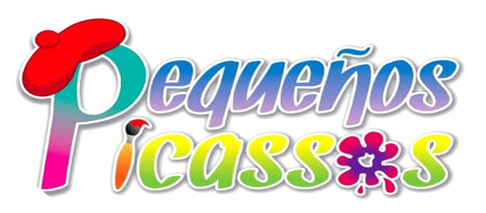

# Pequeños Picassos

Este es el repositorio del sitio web, creado por Carlos Jiménez.

## Archivos del repositorio

Hay una carpeta (app) en el repositorio
- En la carpeta (app) contiene 3 subcarpetas en las cuales están los distintos recursos del sitio web. 

## Instrucciones para ejecutar el sitio web

Clona el proyecto en tu computadora

`git clone https://github.com/cjimenezdev/Picassos`

Para poder ejecutar el sitio web completo abre el archivo `ìndex.html`.

## Tutorial en Youtube

Los invito a seguirme en cada una de mis redes sociales oficiales y si necesitan algún proyecto pueden contactarme o enviarme un mensaje.
